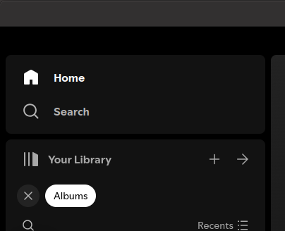
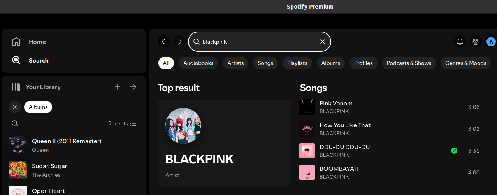
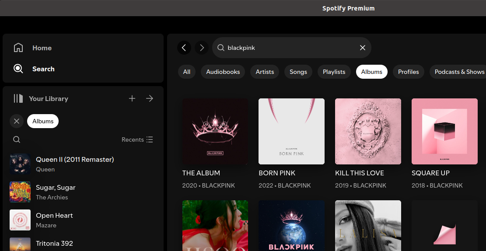
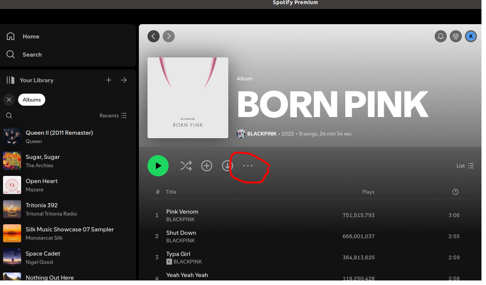
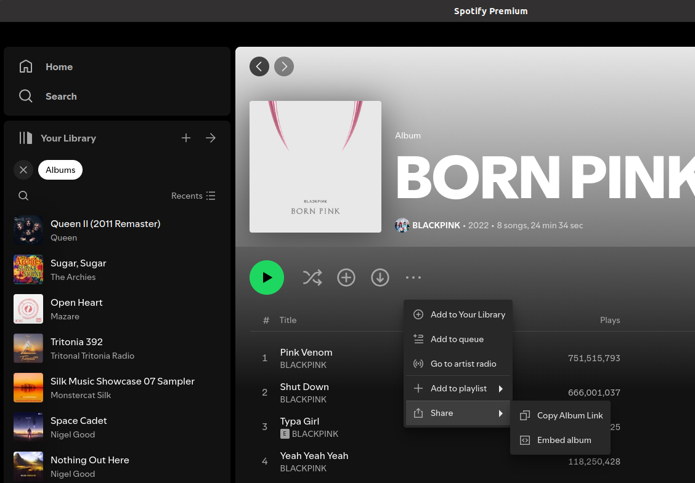
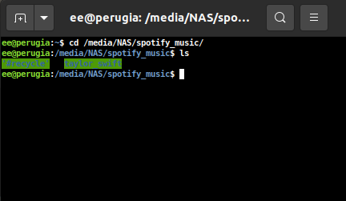

# How to Download Music
## Introduction

We use spotify to listen to music in the car, when we do this we require a phone with internet connection. In the case of your headphones, you need to first download the music to your computer and then transfer it to your headphones.

This guide will show you how to download music from Spotify to your computer and then transfer it to your headphones.

## Step 1: Finding Music on Spotify
### Open Spotify on your computer.


Click on the Spotify icon on your desktop to open the application.

### Search for the music you want to download.


### Search for the artist you want to download.


I recommend you search for the artist and then click on Albums to see all the albums available.



### Click on the album you want to download.

### Click on the three dots on the right side of the album.



### Click Share, then click Copy Album Link.



It will then say something like "Link Copied" at the bottom of the screen. This means the link has been copied to your clipboard, which means you can now paste the link into another application on your computer.

## Step 2: Downloading Music from Spotify

### Open a new terminal window on your computer.
The easy way to do this is to press the Windows key and type "cmd" and press Enter.

### Change to the directory where you want to download the music.
You computer is like a filing cabinet, you need to tell it where to put the music you are downloading. You can do this by typing `cd` followed by the path to the directory you want to download the music to. We want to download the music to the spotify_music directory on the backed up drive. To do this, ensure you have clicked on the terminal window and type the following command:

```bash
cd /media/NAS/spotify_music
```

### Have a look around the directory.
At this point, you can type `ls` to see what is in the directory. You should see a list of directories and files.

```bash
ls
```

