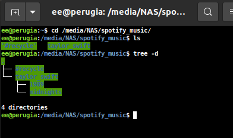
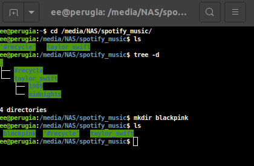
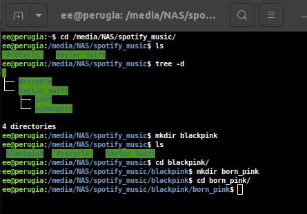
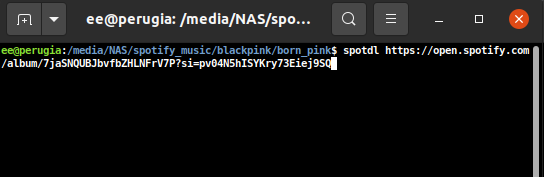
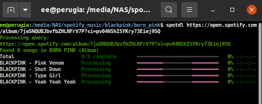
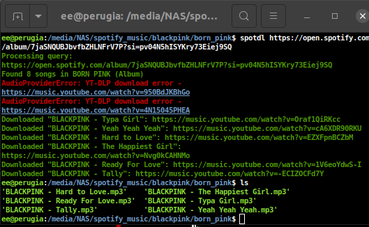
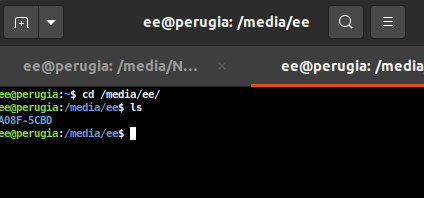
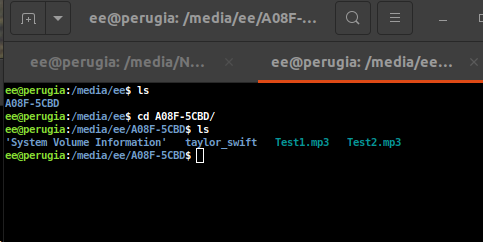

# How to Download Music
## Introduction

We use spotify to listen to music in the car, when we do this we require a phone with internet connection. In the case of your headphones, you need to first download the music to your computer and then transfer it to your headphones.

This guide will show you how to download music from Spotify to your computer and then transfer it to your headphones.

## Step 1: Finding Music on Spotify
### Open Spotify on your computer.


Click on the Spotify icon on your desktop to open the application.

### Search for the music you want to download.


### Search for the artist you want to download.


I recommend you search for the artist and then click on Albums to see all the albums available.


### Click on the album you want to download.

### Click on the three dots on the right side of the album.


### Click Share, then click Copy Album Link.


It will then say something like "Link Copied" at the bottom of the screen. This means the link has been copied to your clipboard, which means you can now paste the link into another application on your computer.

## Step 2: Downloading Music from Spotify

### Open a new terminal window on your computer.
The easy way to do this is to press the Windows key and type "cmd" and press Enter.

### Change to the directory where you want to download the music.
You computer is like a filing cabinet, you need to tell it where to put the music you are downloading. You can do this by typing `cd` followed by the path to the directory you want to download the music to. We want to download the music to the spotify_music directory on the backed up drive. To do this, ensure you have clicked on the terminal window and type the following command:

```bash
cd /media/NAS/spotify_music
```

### Have a look around the directory.
At this point, you can type `ls` to see what is in the directory. You should see a list of directories and files.

```bash
ls
```


You can also use the command `tree` to see a tree view of the directories and files. tree can be used with "the flag" -d to only show directories. These are like little folders that you can put files in.

```bash
tree -d
```



Try typing tree without the -d flag to see the files as well.

### Decide where you want to put the music.

From the screenshot above, you can see that there is a directory called taylor_swift, and inside that directory there are directories for two of her albums. Earlier in this guide, I searched for the artist BlackPink and then clicked on the album "Born Pink". I will download this album to the directory /media/NAS/spotify_music/blackpink/born_pink. To do this, I will create the directory blackpink and then the directory born_pink. I will then download the music to the born_pink directory. You will need to do something similar for the music you want to download. **It won't be the same as mine, if you don't already have a directory for the artist you want to download, you will need to create a directory for the artist and then a directory for the album.** It could be the case that the artist is already present in the directory, in which case you can just create a directory for the album.

To create the directory blackpink, I type the following command:

```bash
mkdir blackpink
```

At this point, I can type `ls` to see the directory I just created.

```bash
ls
```


I can then change to the directory blackpink by typing the following command:

```bash
cd blackpink
```

I can then create the directory born_pink by typing the following command:

```bash
mkdir born_pink
```

I can then change to the directory born_pink by typing the following command:

```bash
cd born_pink
```



At this point, we have successfully created the directory structure to download the music to. We can now download the music.

## Step 3: Downloading the Music

### Download the music using the link you copied earlier.
It could be the case that the link you copied into your clipboard earlier has been lost. If this is the case, you will need to go back to Spotify and copy the link again. If you still have the link in your clipboard, you can paste it into the terminal window by either 'middle clicking' or right clicking and selecting paste. Likely the best thing to do is to go and copy the link again. See the section above on how to do this "Click Share, then click Copy Album Link".



This will then start to download the music. You will see a progress bar that shows how much of the music has been downloaded.



Once the music has been downloaded, you can then see the files in the directory by typing `ls`.

```bash
ls
```



## Step 4: Transferring the Music to your Headphones

### Connect your headphones to your computer. 
Ensure only one set of headphones is connected to your computer. This will make it easier to find the headphones in the file manager.

### Create a new terminal window.
Click on the terminal window and press `Ctrl + Shift + T`. This will open a new terminal window in the same directory as the previous terminal window.

### Change to the directory where your headphones are mounted.

```bash
cd /media/ee
```
Have a look around the directory by typing `ls`.

```bash
ls
```

This should return something like the following: 3C4D-1A2B, it won't look like this, but it will be similar, this will be the directory where your headphones are mounted.



### Change to the directory where you want to put the music on your headphones.

```bash
cd 3C4D-1A2B
```

Have a look around the directory by typing `ls`.

```bash
ls
```



